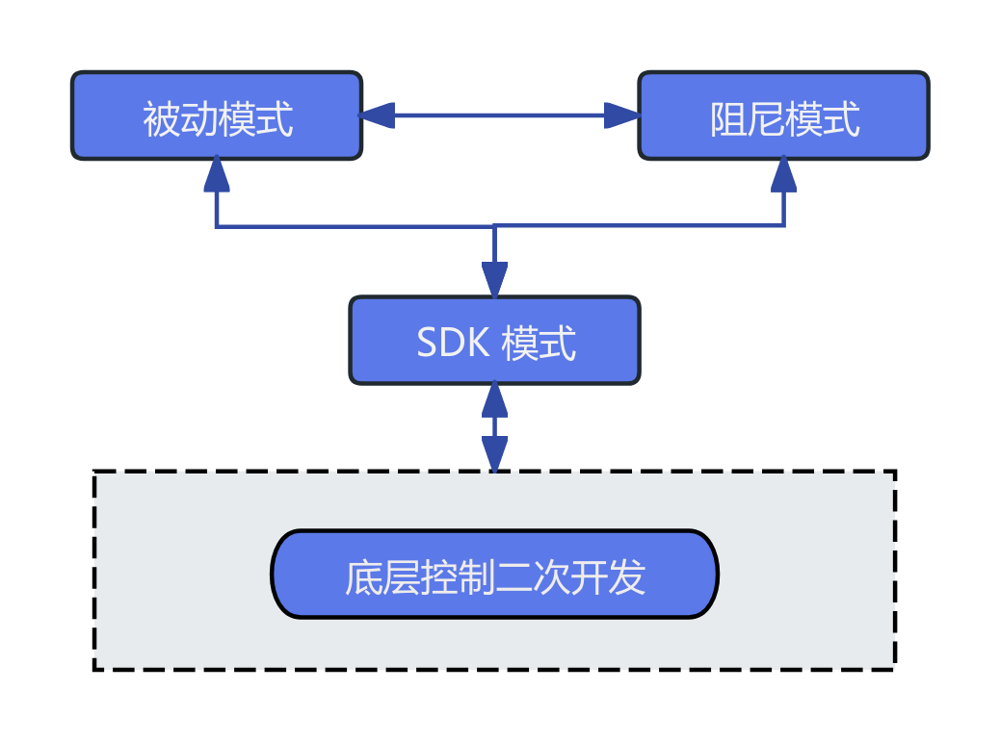

# 底层运动控制服务

> 提供机器人系统底层运动控制服务，通过LowLevelMotionController可以通过话题通信方式实现对机器人的关节进行指令控制和状态获取。

## 接口定义
`LowLevelMotionController` 是面向底层开发的运动控制器，支持对手臂、腿、头、腰、手等运动部件的直接控制与状态订阅，以及身体IMU数据的获取。

### LowLevelMotionController
<table style="width: 100%; table-layout: fixed; border-collapse: collapse; text-align: left;">
  <thead>
    <tr>
      <th style="width: 40%; text-align: center;"><strong>项目</strong></th>
      <th style="width: 60%; text-align: center;"><strong>内容</strong></th>
    </tr>
  </thead>
  <tbody>
    <tr>
      <td>函数名</td>
      <td>LowLevelMotionController</td>
    </tr>
    <tr>
      <td>函数声明</td>
      <td><code>LowLevelMotionController();</code></td>
    </tr>
    <tr>
      <td>功能概述</td>
      <td>构造函数，初始化低层控制器对象。</td>
    </tr>
    <tr>
      <td>备注</td>
      <td>构造内部资源。</td>
    </tr>
  </tbody>
</table>

### ~LowLevelMotionController
<table style="width: 100%; table-layout: fixed; border-collapse: collapse; text-align: left;">
  <thead>
    <tr>
      <th style="width: 40%; text-align: center;"><strong>项目</strong></th>
      <th style="width: 60%; text-align: center;"><strong>内容</strong></th>
    </tr>
  </thead>
  <tbody>
    <tr>
      <td>函数名</td>
      <td>~LowLevelMotionController</td>
    </tr>
    <tr>
      <td>函数声明</td>
      <td><code>virtual ~LowLevelMotionController();</code></td>
    </tr>
    <tr>
      <td>功能概述</td>
      <td>析构函数，释放资源。</td>
    </tr>
    <tr>
      <td>备注</td>
      <td>清理底层资源。</td>
    </tr>
  </tbody>
</table>

### Initialize
<table style="width: 100%; table-layout: fixed; border-collapse: collapse; text-align: left;">
  <thead>
    <tr>
      <th style="width: 40%; text-align: center;"><strong>项目</strong></th>
      <th style="width: 60%; text-align: center;"><strong>内容</strong></th>
    </tr>
  </thead>
  <tbody>
    <tr>
      <td>函数名</td>
      <td>Initialize</td>
    </tr>
    <tr>
      <td>函数声明</td>
      <td><code>virtual bool Initialize() override;</code></td>
    </tr>
    <tr>
      <td>功能概述</td>
      <td>初始化控制器，建立底层连接。</td>
    </tr>
    <tr>
      <td>返回值</td>
      <td><code>true</code> 表示成功，<code>false</code> 表示失败。</td>
    </tr>
    <tr>
      <td>备注</td>
      <td>首次调用必须初始化。</td>
    </tr>
  </tbody>
</table>

### Shutdown
<table style="width: 100%; table-layout: fixed; border-collapse: collapse; text-align: left;">
  <thead>
    <tr>
      <th style="width: 40%; text-align: center;"><strong>项目</strong></th>
      <th style="width: 60%; text-align: center;"><strong>内容</strong></th>
    </tr>
  </thead>
  <tbody>
    <tr>
      <td>函数名</td>
      <td>Shutdown</td>
    </tr>
    <tr>
      <td>函数声明</td>
      <td><code>virtual void Shutdown() override;</code></td>
    </tr>
    <tr>
      <td>功能概述</td>
      <td>关闭控制器，释放底层资源。</td>
    </tr>
    <tr>
      <td>备注</td>
      <td>配合 Initialize 使用。</td>
    </tr>
  </tbody>
</table>

### SetPeriodMs
<table style="width: 100%; table-layout: fixed; border-collapse: collapse; text-align: left;">
  <thead>
    <tr>
      <th style="width: 40%; text-align: center;"><strong>项目</strong></th>
      <th style="width: 60%; text-align: center;"><strong>内容</strong></th>
    </tr>
  </thead>
  <tbody>
    <tr>
      <td>函数名</td>
      <td>SetPeriodMs</td>
    </tr>
    <tr>
      <td>函数声明</td>
      <td><code>void SetPeriodMs(uint64_t period_ms);</code></td>
    </tr>
    <tr>
      <td>功能概述</td>
      <td>设置控制周期时间（毫秒）。</td>
    </tr>
    <tr>
      <td>参数说明</td>
      <td><code>period_ms</code>：周期时间，单位为毫秒。</td>
    </tr>
    <tr>
      <td>备注</td>
      <td>非阻塞接口，控制器内部使用的周期参数，控制关节指令的发送频率。</td>
    </tr>
  </tbody>
</table>

### SubscribeArmState
<table style="width: 100%; table-layout: fixed; border-collapse: collapse; text-align: left;">
  <thead>
    <tr>
      <th style="width: 40%; text-align: center;"><strong>项目</strong></th>
      <th style="width: 60%; text-align: center;"><strong>内容</strong></th>
    </tr>
  </thead>
  <tbody>
    <tr>
      <td>函数名</td>
      <td>SubscribeArmState</td>
    </tr>
    <tr>
      <td>函数声明</td>
      <td><code>void SubscribeArmState(ArmJointStateCallback callback);</code></td>
    </tr>
    <tr>
      <td>功能概述</td>
      <td>订阅手臂关节状态数据</td>
    </tr>
    <tr>
      <td>参数说明</td>
      <td>callback：接收数据处理函数</td>
    </tr>
    <tr>
      <td>备注</td>
      <td>非阻塞接口。</td>
    </tr>
  </tbody>
</table>

### PublishArmCommand
<table style="width: 100%; table-layout: fixed; border-collapse: collapse; text-align: left;">
  <thead>
    <tr>
      <th style="width: 40%; text-align: center;"><strong>项目</strong></th>
      <th style="width: 60%; text-align: center;"><strong>内容</strong></th>
    </tr>
  </thead>
  <tbody>
    <tr>
      <td>函数名</td>
      <td>PublishArmCommand</td>
    </tr>
    <tr>
      <td>函数声明</td>
      <td><code>Status PublishArmCommand(const JointCommand& command);</code></td>
    </tr>
    <tr>
      <td>功能概述</td>
      <td>发布手臂控制指令</td>
    </tr>
    <tr>
      <td>参数说明</td>
      <td>command：目标位置/速度等</td>
    </tr>
    <tr>
      <td>返回值</td>
      <td><code>true</code> 表示成功，<code>false</code> 表示失败。</td>
    </tr>
    <tr>
      <td>备注</td>
      <td>非阻塞接口。</td>
    </tr>
  </tbody>
</table>

### SubscribeLegState
<table style="width: 100%; table-layout: fixed; border-collapse: collapse; text-align: left;">
  <thead>
    <tr>
      <th style="width: 40%; text-align: center;"><strong>项目</strong></th>
      <th style="width: 60%; text-align: center;"><strong>内容</strong></th>
    </tr>
  </thead>
  <tbody>
    <tr>
      <td>函数名</td>
      <td>SubscribeLegState</td>
    </tr>
    <tr>
      <td>函数声明</td>
      <td><code>void SubscribeLegState(LegJointStateCallback callback);</code></td>
    </tr>
    <tr>
      <td>功能概述</td>
      <td>订阅腿部关节状态数据</td>
    </tr>
    <tr>
      <td>参数说明</td>
      <td>callback：接收数据处理函数</td>
    </tr>
    <tr>
      <td>备注</td>
      <td>非阻塞接口。</td>
    </tr>
  </tbody>
</table>

### PublishLegCommand
<table style="width: 100%; table-layout: fixed; border-collapse: collapse; text-align: left;">
  <thead>
    <tr>
      <th style="width: 40%; text-align: center;"><strong>项目</strong></th>
      <th style="width: 60%; text-align: center;"><strong>内容</strong></th>
    </tr>
  </thead>
  <tbody>
    <tr>
      <td>函数名</td>
      <td>PublishLegCommand</td>
    </tr>
    <tr>
      <td>函数声明</td>
      <td><code>Status PublishLegCommand(const JointCommand& command);</code></td>
    </tr>
    <tr>
      <td>功能概述</td>
      <td>发布腿部控制指令</td>
    </tr>
    <tr>
      <td>参数说明</td>
      <td>command：目标位置/速度等</td>
    </tr>
    <tr>
      <td>返回值</td>
      <td><code>true</code> 表示成功，<code>false</code> 表示失败。</td>
    </tr>
    <tr>
      <td>备注</td>
      <td>非阻塞接口，发布或订阅时调用。</td>
    </tr>
  </tbody>
</table>

### SubscribeHeadState
<table style="width: 100%; table-layout: fixed; border-collapse: collapse; text-align: left;">
  <thead>
    <tr>
      <th style="width: 40%; text-align: center;"><strong>项目</strong></th>
      <th style="width: 60%; text-align: center;"><strong>内容</strong></th>
    </tr>
  </thead>
  <tbody>
    <tr>
      <td>函数名</td>
      <td>SubscribeHeadState</td>
    </tr>
    <tr>
      <td>函数声明</td>
      <td><code>void SubscribeHeadState(HeadJointStateCallback callback);</code></td>
    </tr>
    <tr>
      <td>功能概述</td>
      <td>订阅头部关节状态数据</td>
    </tr>
    <tr>
      <td>参数说明</td>
      <td>callback：接收数据处理函数</td>
    </tr>
    <tr>
      <td>备注</td>
      <td>非阻塞接口。</td>
    </tr>
  </tbody>
</table>

### PublishHeadCommand
<table style="width: 100%; table-layout: fixed; border-collapse: collapse; text-align: left;">
  <thead>
    <tr>
      <th style="width: 40%; text-align: center;"><strong>项目</strong></th>
      <th style="width: 60%; text-align: center;"><strong>内容</strong></th>
    </tr>
  </thead>
  <tbody>
    <tr>
      <td>函数名</td>
      <td>PublishHeadCommand</td>
    </tr>
    <tr>
      <td>函数声明</td>
      <td><code>Status PublishHeadCommand(const JointCommand& command);</code></td>
    </tr>
    <tr>
      <td>功能概述</td>
      <td>发布头部控制指令</td>
    </tr>
    <tr>
      <td>参数说明</td>
      <td>command：目标位置/速度等</td>
    </tr>
    <tr>
      <td>返回值</td>
      <td><code>true</code> 表示成功，<code>false</code> 表示失败。</td>
    </tr>
    <tr>
      <td>备注</td>
      <td>非阻塞接口。</td>
    </tr>
  </tbody>
</table>

### SubscribeWaistState
<table style="width: 100%; table-layout: fixed; border-collapse: collapse; text-align: left;">
  <thead>
    <tr>
      <th style="width: 40%; text-align: center;"><strong>项目</strong></th>
      <th style="width: 60%; text-align: center;"><strong>内容</strong></th>
    </tr>
  </thead>
  <tbody>
    <tr>
      <td>函数名</td>
      <td>SubscribeWaistState</td>
    </tr>
    <tr>
      <td>函数声明</td>
      <td><code>void SubscribeWaistState(WaistJointStateCallback callback);</code></td>
    </tr>
    <tr>
      <td>功能概述</td>
      <td>订阅腰部关节状态数据</td>
    </tr>
    <tr>
      <td>参数说明</td>
      <td>callback：接收数据处理函数</td>
    </tr>
    <tr>
      <td>备注</td>
      <td>非阻塞接口。</td>
    </tr>
  </tbody>
</table>

### PublishWaistCommand
<table style="width: 100%; table-layout: fixed; border-collapse: collapse; text-align: left;">
  <thead>
    <tr>
      <th style="width: 40%; text-align: center;"><strong>项目</strong></th>
      <th style="width: 60%; text-align: center;"><strong>内容</strong></th>
    </tr>
  </thead>
  <tbody>
    <tr>
      <td>函数名</td>
      <td>PublishWaistCommand</td>
    </tr>
    <tr>
      <td>函数声明</td>
      <td><code>Status PublishWaistCommand(const JointCommand& command);</code></td>
    </tr>
    <tr>
      <td>功能概述</td>
      <td>发布腰部控制指令</td>
    </tr>
    <tr>
      <td>参数说明</td>
      <td>command：目标位置/速度等</td>
    </tr>
    <tr>
      <td>返回值</td>
      <td><code>true</code> 表示成功，<code>false</code> 表示失败。</td>
    </tr>
    <tr>
      <td>备注</td>
      <td>非阻塞接口。</td>
    </tr>
  </tbody>
</table>

### SubscribeHandState
<table style="width: 100%; table-layout: fixed; border-collapse: collapse; text-align: left;">
  <thead>
    <tr>
      <th style="width: 40%; text-align: center;"><strong>项目</strong></th>
      <th style="width: 60%; text-align: center;"><strong>内容</strong></th>
    </tr>
  </thead>
  <tbody>
    <tr>
      <td>函数名</td>
      <td>SubscribeHandState</td>
    </tr>
    <tr>
      <td>函数声明</td>
      <td><code>void SubscribeHandState(HandStateCallback callback);</code></td>
    </tr>
    <tr>
      <td>功能概述</td>
      <td>订阅手部状态数据</td>
    </tr>
    <tr>
      <td>参数说明</td>
      <td>callback：接收数据处理函数</td>
    </tr>
    <tr>
      <td>备注</td>
      <td>非阻塞接口。</td>
    </tr>
  </tbody>
</table>

### PublishHandCommand
<table style="width: 100%; table-layout: fixed; border-collapse: collapse; text-align: left;">
  <thead>
    <tr>
      <th style="width: 40%; text-align: center;"><strong>项目</strong></th>
      <th style="width: 60%; text-align: center;"><strong>内容</strong></th>
    </tr>
  </thead>
  <tbody>
    <tr>
      <td>函数名</td>
      <td>PublishHandCommand</td>
    </tr>
    <tr>
      <td>函数声明</td>
      <td><code>Status PublishHandCommand(const HandCommand& command);</code></td>
    </tr>
    <tr>
      <td>功能概述</td>
      <td>发布手部控制指令</td>
    </tr>
    <tr>
      <td>参数说明</td>
      <td>command：手部关节目标位置等</td>
    </tr>
    <tr>
      <td>返回值</td>
      <td><code>true</code> 表示成功，<code>false</code> 表示失败。</td>
    </tr>
    <tr>
      <td>备注</td>
      <td>非阻塞接口。</td>
    </tr>
  </tbody>
</table>

### SubscribeBodyImu
<table style="width: 100%; table-layout: fixed; border-collapse: collapse; text-align: left;">
  <thead>
    <tr>
      <th style="width: 40%; text-align: center;"><strong>项目</strong></th>
      <th style="width: 60%; text-align: center;"><strong>内容</strong></th>
    </tr>
  </thead>
  <tbody>
    <tr>
      <td>函数名</td>
      <td>SubscribeBodyImu</td>
    </tr>
    <tr>
      <td>函数声明</td>
      <td><code>void SubscribeBodyImu(const BodyImuCallback& callback);</code></td>
    </tr>
    <tr>
      <td>功能概述</td>
      <td>订阅机体 IMU 数据</td>
    </tr>
    <tr>
      <td>参数说明</td>
      <td>callback：IMU 数据处理函数</td>
    </tr>
    <tr>
      <td>备注</td>
      <td>非阻塞接口。</td>
    </tr>
  </tbody>
</table>

## 类型定义

### `SingleHandJointCommand` — 单个手部关节的控制命令

<table style="width: 100%; table-layout: fixed; border-collapse: collapse; text-align: left;">
  <thead>
    <tr>
      <th style="width: 20%; text-align: center;"><strong>字段名</strong></th>
      <th style="width: 40%; text-align: center;"><strong>类型</strong></th>
      <th style="width: 40%; text-align: center;"><strong>描述</strong></th>
    </tr>
  </thead>
  <tbody>
    <tr>
      <td><code>operation_mode</code></td>
      <td><code>int16_t</code></td>
      <td>
        控制字 
      </td>
    </tr>
    <tr>
      <td><code>pos</code></td>
      <td><code>vector&lt;float&gt;</code></td>
      <td>
        期望位置数组（7个自由度，单位：rad） 
      </td>
    </tr>
  </tbody>
</table>

---

### `HandCommand` — 整个手部控制命令

<table style="width: 100%; table-layout: fixed; border-collapse: collapse; text-align: left;">
  <thead>
    <tr>
      <th style="width: 20%; text-align: center;"><strong>字段名</strong></th>
      <th style="width: 40%; text-align: center;"><strong>类型</strong></th>
      <th style="width: 40%; text-align: center;"><strong>描述</strong></th>
    </tr>
  </thead>
  <tbody>
    <tr>
      <td><code>timestamp</code></td>
      <td><code>int64_t</code></td>
      <td>
        时间戳（单位：纳秒） 
      </td>
    </tr>
    <tr>
      <td><code>cmd</code></td>
      <td><code>vector&lt;SingleHandJointCommand&gt;</code></td>
      <td>
        控制命令数组，依次为左手和右手 
      </td>
    </tr>
  </tbody>
</table>

---

### `SingleHandJointState` — 单个手部关节的状态

<table style="width: 100%; table-layout: fixed; border-collapse: collapse; text-align: left;">
  <thead>
    <tr>
      <th style="width: 20%; text-align: center;"><strong>字段名</strong></th>
      <th style="width: 40%; text-align: center;"><strong>类型</strong></th>
      <th style="width: 40%; text-align: center;"><strong>描述</strong></th>
    </tr>
  </thead>
  <tbody>
    <tr>
      <td><code>status_word</code></td>
      <td><code>int16_t</code></td>
      <td>
        状态字 
      </td>
    </tr>
    <tr>
      <td><code>pos</code></td>
      <td><code>vector&lt;float&gt;</code></td>
      <td>
        当前位置（单位：rad） 
      </td>
    </tr>
    <tr>
      <td><code>toq</code></td>
      <td><code>vector&lt;float&gt;</code></td>
      <td>
        当前力矩（单位：Nm） 
      </td>
    </tr>
    <tr>
      <td><code>cur</code></td>
      <td><code>vector&lt;float&gt;</code></td>
      <td>
        当前电流（单位：A） 
      </td>
    </tr>
    <tr>
      <td><code>error_code</code></td>
      <td><code>int16_t</code></td>
      <td>
        错误码 
      </td>
    </tr>
  </tbody>
</table>

---

### `HandState` — 整个手部状态信息

<table style="width: 100%; table-layout: fixed; border-collapse: collapse; text-align: left;">
  <thead>
    <tr>
      <th style="width: 20%; text-align: center;"><strong>字段名</strong></th>
      <th style="width: 40%; text-align: center;"><strong>类型</strong></th>
      <th style="width: 40%; text-align: center;"><strong>描述</strong></th>
    </tr>
  </thead>
  <tbody>
    <tr>
      <td><code>timestamp</code></td>
      <td><code>int64_t</code></td>
      <td>
        时间戳（单位：纳秒） 
      </td>
    </tr>
    <tr>
      <td><code>state</code></td>
      <td><code>vector&lt;SingleHandJointState&gt;</code></td>
      <td>
        所有手部关节状态（左手、右手顺序） 
      </td>
    </tr>
  </tbody>
</table>

---

### `SingleJointCommand` — 单个关节的控制命令

<table style="width: 100%; table-layout: fixed; border-collapse: collapse; text-align: left;">
  <thead>
    <tr>
      <th style="width: 20%; text-align: center;"><strong>字段名</strong></th>
      <th style="width: 40%; text-align: center;"><strong>类型</strong></th>
      <th style="width: 40%; text-align: center;"><strong>描述</strong></th>
    </tr>
  </thead>
  <tbody>
    <tr>
      <td><code>operation_mode</code></td>
      <td><code>int16_t</code></td>
      <td>
        控制模式标识： 
        • 200=准备状态  
        • 3=混合环力控（位置+力矩） 
        • 4=串联PID（位置环+速度环） 
        • 5=ADRC位控（自抗扰控制）
      </td>
    </tr>
    <tr>
      <td><code>pos</code></td>
      <td><code>float</code></td>
      <td>
        目标位置（单位：rad） 
      </td>
    </tr>
    <tr>
      <td><code>vel</code></td>
      <td><code>float</code></td>
      <td>
        速度限制（单位：rad/s） 
      </td>
    </tr>
    <tr>
      <td><code>toq</code></td>
      <td><code>float</code></td>
      <td>
        力矩限制（单位：Nm） 
      </td>
    </tr>
    <tr>
      <td><code>kp</code></td>
      <td><code>float</code></td>
      <td>
        位置环比例增益 
      </td>
    </tr>
    <tr>
      <td><code>kd</code></td>
      <td><code>float</code></td>
      <td>
        速度环微分增益 
      </td>
    </tr>
  </tbody>
</table>

- 左臂或者右臂1-5关节operation_mode需要从模式：200切换到模式：4（串联PID模式）进行指令下发；
- 腰部1关节operation_mode需要从模式：200切切换到模式：5（ADRC位控模式）进行指令下发；
- 左腿或者右腿1-6关节operation_mode需要从模式：200切切换到模式：3（混合环力控模式）和ADRC位控模式（5）进行指令下发；

---

### `JointCommand` — 关节控制命令

下肢包含 12 个关节项，上肢 10(14) 个，头部 1(2) 个，腰部 1 个：

<table style="width: 100%; table-layout: fixed; border-collapse: collapse; text-align: left;">
  <thead>
    <tr>
      <th style="width: 20%; text-align: center;"><strong>字段名</strong></th>
      <th style="width: 40%; text-align: center;"><strong>类型</strong></th>
      <th style="width: 40%; text-align: center;"><strong>描述</strong></th>
    </tr>
  </thead>
  <tbody>
    <tr>
      <td><code>timestamp</code></td>
      <td><code>int64_t</code></td>
      <td>
        时间戳（单位：纳秒） 
      </td>
    </tr>
    <tr>
      <td><code>joints</code></td>
      <td><code>vector&lt;SingleJointCommand&gt;</code></td>
      <td>
        所有关节的控制命令
      </td>
    </tr>
  </tbody>
</table>

---

### `SingleJointState` — 单个关节的状态信息

<table style="width: 100%; table-layout: fixed; border-collapse: collapse; text-align: left;">
  <thead>
    <tr>
      <th style="width: 20%; text-align: center;"><strong>字段名</strong></th>
      <th style="width: 40%; text-align: center;"><strong>类型</strong></th>
      <th style="width: 40%; text-align: center;"><strong>描述</strong></th>
    </tr>
  </thead>
  <tbody>
    <tr>
      <td><code>status_word</code></td>
      <td><code>int16_t</code></td>
      <td>当前关节状态（自定义状态机编码）</td>
    </tr>
    <tr>
      <td><code>posH</code></td>
      <td><code>float</code></td>
      <td>实际位置（高精度编码器读数）</td>
    </tr>
    <tr>
      <td><code>posL</code></td>
      <td><code>float</code></td>
      <td>实际位置（低精度编码器读数，用于冗余校验）</td>
    </tr>
    <tr>
      <td><code>vel</code></td>
      <td><code>float</code></td>
      <td>当前速度（单位：rad/s 或 m/s，根据关节类型自动切换）</td>
    </tr>
    <tr>
      <td><code>toq</code></td>
      <td><code>float</code></td>
      <td>当前力矩（单位：Nm）</td>
    </tr>
    <tr>
      <td><code>current</code></td>
      <td><code>float</code></td>
      <td>当前电流（单位：A）</td>
    </tr>
    <tr>
      <td><code>err_code</code></td>
      <td><code>int16_t</code></td>
      <td>错误码（如编码器异常、电机过流等，详见错误码对照表）</td>
    </tr>
  </tbody>
</table>

---

### `JointState` — 关节状态数据

下肢包含 12 个关节项，上肢 10(14) 个，头部 1(2) 个，腰部 1 个：

<table style="width: 100%; table-layout: fixed; border-collapse: collapse; text-align: left;">
  <thead>
    <tr>
      <th style="width: 20%; text-align: center;"><strong>字段名</strong></th>
      <th style="width: 40%; text-align: center;"><strong>类型</strong></th>
      <th style="width: 40%; text-align: center;"><strong>描述</strong></th>
    </tr>
  </thead>
  <tbody>
    <tr>
      <td><code>timestamp</code></td>
      <td><code>int64_t</code></td>
      <td>时间戳（单位：纳秒）</td>
    </tr>
    <tr>
      <td><code>joints</code></td>
      <td><code>vector&lt;SingleJointState&gt;</code></td>
      <td>所有关节的状态数据</td>
    </tr>
  </tbody>
</table>

---

### 关节电机顺序

**头部关节**
<table style="width: 100%; table-layout: fixed; border-collapse: collapse; text-align: center;">
  <thead>
    <tr>
      <th style="width: 30%; text-align: center;"><strong>索引</strong></th>
      <th style="width: 50%; text-align: center;"><strong>关节名</strong></th>
    </tr>
  </thead>
  <tbody>
    <tr>
      <td style="text-align: center;">0</td>
      <td style="text-align: center;"><code>joint_hy</code></td>
    </tr>
    <tr>
      <td style="text-align: center;">1</td>
      <td style="text-align: center;"><code>joint_hp</code></td>
    </tr>
  </tbody>
</table>

**上臂关节**
<table style="width: 100%; table-layout: fixed; border-collapse: collapse; text-align: center;">
  <thead>
    <tr>
      <th style="width: 30%; text-align: center;"><strong>索引</strong></th>
      <th style="width: 50%; text-align: center;"><strong>关节名</strong></th>
    </tr>
  </thead>
  <tbody>
    <tr>
      <td style="text-align: center;">0</td>
      <td style="text-align: center;"><code>joint_la1</code></td>
    </tr>
    <tr>
      <td style="text-align: center;">1</td>
      <td style="text-align: center;"><code>joint_la2</code></td>
    </tr>
    <tr>
      <td style="text-align: center;">2</td>
      <td style="text-align: center;"><code>joint_la3</code></td>
    </tr>
    <tr>
      <td style="text-align: center;">3</td>
      <td style="text-align: center;"><code>joint_la4</code></td>
    </tr>
    <tr>
      <td style="text-align: center;">4</td>
      <td style="text-align: center;"><code>joint_la5</code></td>
    </tr>
    <tr>
      <td style="text-align: center;">5</td>
      <td style="text-align: center;"><code>joint_la6</code></td>
    </tr>
    <tr>
      <td style="text-align: center;">6</td>
      <td style="text-align: center;"><code>joint_ra7</code></td>
    </tr>
    <tr>
      <td style="text-align: center;">7</td>
      <td style="text-align: center;"><code>joint_ra1</code></td>
    </tr>
    <tr>
      <td style="text-align: center;">8</td>
      <td style="text-align: center;"><code>joint_ra2</code></td>
    </tr>
    <tr>
      <td style="text-align: center;">9</td>
      <td style="text-align: center;"><code>joint_ra3</code></td>
    </tr>
    <tr>
      <td style="text-align: center;">10</td>
      <td style="text-align: center;"><code>joint_ra4</code></td>
    </tr>
    <tr>
      <td style="text-align: center;">11</td>
      <td style="text-align: center;"><code>joint_ra5</code></td>
    </tr>
    <tr>
      <td style="text-align: center;">12</td>
      <td style="text-align: center;"><code>joint_ra6</code></td>
    </tr>
    <tr>
      <td style="text-align: center;">13</td>
      <td style="text-align: center;"><code>joint_ra7</code></td>
    </tr>
  </tbody>
</table>

**腰部关节**
<table style="width: 100%; table-layout: fixed; border-collapse: collapse; text-align: center;">
  <thead>
    <tr>
      <th style="width: 30%; text-align: center;"><strong>索引</strong></th>
      <th style="width: 50%; text-align: center;"><strong>关节名</strong></th>
    </tr>
  </thead>
  <tbody>
    <tr>
      <td style="text-align: center;">0</td>
      <td style="text-align: center;"><code>joint_wy</code></td>
    </tr>
  </tbody>
</table>

**腿部关节**
<table style="width: 100%; table-layout: fixed; border-collapse: collapse; text-align: center;">
  <thead>
    <tr>
      <th style="width: 30%; text-align: center;"><strong>索引</strong></th>
      <th style="width: 50%; text-align: center;"><strong>关节名</strong></th>
    </tr>
  </thead>
  <tbody>
    <tr>
      <td style="text-align: center;">0</td>
      <td style="text-align: center;"><code>left hip roll</code></td>
    </tr>
    <tr>
      <td style="text-align: center;">1</td>
      <td style="text-align: center;"><code>left hip yaw</code></td>
    </tr>
    <tr>
      <td style="text-align: center;">2</td>
      <td style="text-align: center;"><code>left hip pitch</code></td>
    </tr>
    <tr>
      <td style="text-align: center;">3</td>
      <td style="text-align: center;"><code>left knee pitch</code></td>
    </tr>
    <tr>
      <td style="text-align: center;">4</td>
      <td style="text-align: center;"><code>left ankle pitch</code></td>
    </tr>
    <tr>
      <td style="text-align: center;">5</td>
      <td style="text-align: center;"><code>left ankle roll</code></td>
    </tr>
    <tr>
      <td style="text-align: center;">6</td>
      <td style="text-align: center;"><code>right hip roll</code></td>
    </tr>
    <tr>
      <td style="text-align: center;">7</td>
      <td style="text-align: center;"><code>right hip yaw</code></td>
    </tr>
    <tr>
      <td style="text-align: center;">8</td>
      <td style="text-align: center;"><code>right hip pitch</code></td>
    </tr>
    <tr>
      <td style="text-align: center;">9</td>
      <td style="text-align: center;"><code>right knee pitch</code></td>
    </tr>
    <tr>
      <td style="text-align: center;">10</td>
      <td style="text-align: center;"><code>right ankle pitch</code></td>
    </tr>
    <tr>
      <td style="text-align: center;">11</td>
      <td style="text-align: center;"><code>right ankle roll</code></td>
    </tr>
  </tbody>
</table>

## URDF参考

[机器人URDF](https://github.com/MagiclabRobotics/magicbot-z1_description)

## 底层运动控制机器人状态介绍

机器人底层运动主要是开发关节的三环控制给开发人员进行机器人运动能力的二次开发，基本的控制状态切换机制：

