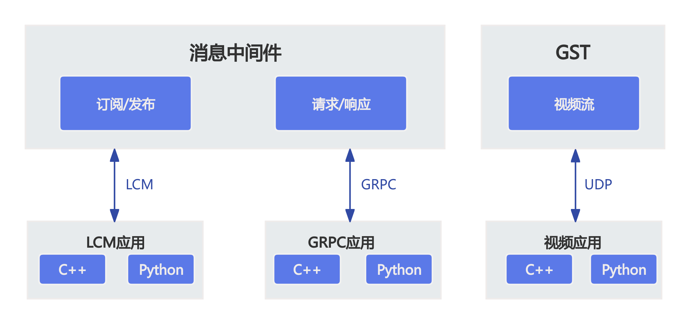

# SDK 概述

## SDK 通信接口介绍

> - 当前软件版本暂不支持GST视频流传输

Z1采用LCM/GRPC作为消息中间件，主要数据交互模式：话题（订阅/发布）和RPC（请求/响应）
- **话题（订阅/发布）**：接收方订阅某个消息，发送方根据订阅列表向接收方发送消息，主要用于中高频或持续的数据交互。
- **RPC（请求/响应）**：问答模式，通过请求实现数据获取或操作。用于低频或功能切换时的数据交互。

话题和RPC接口的主要调用方式：函数式接口
- **函数式接口**：将 API 调用封装成函数调用，方便用户使用。

## 获取 SDK

**magicbot-z1_sdk**是魔法原子新一代机器人Z1开发SDK。SDK将高层运动控制、底层电机控制、语音控制等接口进行封装，并提供相关的函数式接口。
您可以参考我们提供的SDK教程，学习机器人控制，完成z1的二次开发；

### SDK 下载地址：

[magicbot-z1_sdk](https://github.com/MagiclabRobotics/magicbot-z1_sdk)

### URDF/MJCF 下载地址:

[URDF/MJCF](https://github.com/MagiclabRobotics/magicbot-z1_description)