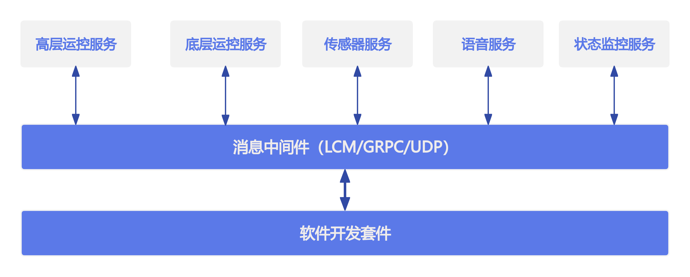

# 服务介绍

Magicbot Z1通过消息中间件（LCM/GRPC/UDP）提供如下服务：

- **高层运控服务**

基于Z1内置步态控制器，可进行步态切换、特技执行、控制姿态和速度（等价遥控器）等功能。高层运控服务使用GRPC进行通信。

- **底层运控服务**

通过服务接口可实时获取关节、IMU等数据，同事可实时下发关节指令控制电机。底层运控服务使用lcm进行通信。

- **语音服务**

通过服务接口可控制音量和语音控制。语音服务使用grpc/lcm进行通信。

- **传感器服务**

支持lidar、rgbd、双目相机等传感器的数据订阅。传感器服务使用grpc和lcm进行通信。

- **状态监控服务**

通过服务接口可订阅机器人本体软硬件故障和bms状态。状态监控服务使用grpc进行通信。

