# 高层运动控制服务 (Python)

> 提供机器人系统高层运动控制服务，通过HighLevelMotionController可以通过RPC通信方式实现对机器人的步态、特技、遥控的控制。

## 接口定义
`HighLevelMotionController` 是面向语义控制的高层运动控制器，支持如行走、特技、头部运动等控制操作，封装底层细节以供上层系统调用。

### HighLevelMotionController
<table style="width: 100%; table-layout: fixed; border-collapse: collapse; text-align: left;">
  <thead>
    <tr>
      <th style="width: 40%; text-align: center;"><strong>项目</strong></th>
      <th style="width: 60%; text-align: center;"><strong>内容</strong></th>
    </tr>
  </thead>
  <tbody>
    <tr><td>类名</td><td>HighLevelMotionController</td></tr>
    <tr><td>构造函数</td><td><code>controller = HighLevelMotionController()</code></td></tr>
    <tr><td>功能概述</td><td>构造函数，初始化高层控制器状态</td></tr>
    <tr><td>备注</td><td>构造内部控制资源</td></tr>
  </tbody>
</table>

### initialize
<table style="width: 100%; table-layout: fixed; border-collapse: collapse; text-align: left;">
  <thead>
    <tr>
      <th style="width: 40%; text-align: center;"><strong>项目</strong></th>
      <th style="width: 60%; text-align: center;"><strong>内容</strong></th>
    </tr>
  </thead>
  <tbody>
    <tr><td>函数名</td><td>initialize</td></tr>
    <tr><td>函数声明</td><td><code>bool initialize()</code></td></tr>
    <tr><td>功能概述</td><td>初始化控制器，准备高层控制功能</td></tr>
    <tr><td>返回值</td><td><code>True</code> 表示成功，<code>False</code> 表示失败</td></tr>
    <tr><td>备注</td><td>首次使用前必须调用</td></tr>
  </tbody>
</table>

### shutdown
<table style="width: 100%; table-layout: fixed; border-collapse: collapse; text-align: left;">
  <thead>
    <tr>
      <th style="width: 40%; text-align: center;"><strong>项目</strong></th>
      <th style="width: 60%; text-align: center;"><strong>内容</strong></th>
    </tr>
  </thead>
  <tbody>
    <tr><td>函数名</td><td>shutdown</td></tr>
    <tr><td>函数声明</td><td><code>void shutdown()</code></td></tr>
    <tr><td>功能概述</td><td>关闭控制器并释放资源</td></tr>
    <tr><td>备注</td><td>配合initialize使用，安全断开连接</td></tr>
  </tbody>
</table>

### set_gait
<table style="width: 100%; table-layout: fixed; border-collapse: collapse; text-align: left;">
  <thead>
    <tr>
      <th style="width: 40%; text-align: center;"><strong>项目</strong></th>
      <th style="width: 60%; text-align: center;"><strong>内容</strong></th>
    </tr>
  </thead>
  <tbody>
    <tr><td>函数名</td><td>set_gait</td></tr>
    <tr><td>函数声明</td><td><code>Status set_gait(GaitMode gait_mode)</code></td></tr>
    <tr><td>功能概述</td><td>设置机器人步态模式（如锁定站立、平衡站立、拟人行走等）</td></tr>
    <tr><td>参数说明</td><td><code>gait_mode</code>：步态控制枚举</td></tr>
    <tr><td>返回值</td><td><code>Status</code> 对象，<code>Status.code == ErrorCode.OK</code> 表示成功</td></tr>
    <tr><td>备注</td><td>阻塞接口，可切换多种步态模式</td></tr>
  </tbody>
</table>

### get_gait
<table style="width: 100%; table-layout: fixed; border-collapse: collapse; text-align: left;">
  <thead>
    <tr>
      <th style="width: 40%; text-align: center;"><strong>项目</strong></th>
      <th style="width: 60%; text-align: center;"><strong>内容</strong></th>
    </tr>
  </thead>
  <tbody>
    <tr><td>函数名</td><td>get_gait</td></tr>
    <tr><td>函数声明</td><td><code>Status get_gait()</code></td></tr>
    <tr><td>功能概述</td><td>获取机器人步态模式（如锁定站立、平衡站立、拟人行走等）</td></tr>
    <tr><td>返回值</td><td><code>Status</code> 对象，包含当前步态模式信息</td></tr>
    <tr><td>备注</td><td>阻塞接口，获取当前步态模式</td></tr>
  </tbody>
</table>

### execute_trick
<table style="width: 100%; table-layout: fixed; border-collapse: collapse; text-align: left;">
  <thead>
    <tr>
      <th style="width: 40%; text-align: center;"><strong>项目</strong></th>
      <th style="width: 60%; text-align: center;"><strong>内容</strong></th>
    </tr>
  </thead>
  <tbody>
    <tr><td>函数名</td><td>execute_trick</td></tr>
    <tr><td>函数声明</td><td><code>Status execute_trick(TrickAction trick_action)</code></td></tr>
    <tr><td>功能概述</td><td>执行特技动作（如庆祝、挥手等）</td></tr>
    <tr><td>参数说明</td><td><code>trick_action</code>：特技动作标识</td></tr>
    <tr><td>返回值</td><td><code>Status</code> 对象，<code>Status.code == ErrorCode.OK</code> 表示成功</td></tr>
    <tr><td>备注</td><td>阻塞接口，需确保机器人当前可执行特技 注意事项：特技动作必须要在GaitMode.GAIT_BALANCE_STAND(46)步态下才能进行</td></tr>
  </tbody>
</table>

### send_joystick_command
<table style="width: 100%; table-layout: fixed; border-collapse: collapse; text-align: left;">
  <thead>
    <tr>
      <th style="width: 40%; text-align: center;"><strong>项目</strong></th>
      <th style="width: 60%; text-align: center;"><strong>内容</strong></th>
    </tr>
  </thead>
  <tbody>
    <tr><td>函数名</td><td>send_joystick_command</td></tr>
    <tr><td>函数声明</td><td><code>Status send_joystick_command(JoystickCommand joy_command)</code></td></tr>
    <tr><td>功能概述</td><td>发送实时摇杆控制指令</td></tr>
    <tr><td>参数说明</td><td><code>joy_command</code>：包含摇杆坐标的控制数据</td></tr>
    <tr><td>返回值</td><td><code>Status</code> 对象，<code>Status.code == ErrorCode.OK</code> 表示成功</td></tr>
    <tr><td>备注</td><td>非阻塞接口，建议发送频率为 20Hz</td></tr>
  </tbody>
</table>

## 类型定义

### `JoystickCommand` — 高层运动控制摇杆指令结构体

<table style="width: 100%; table-layout: fixed; border-collapse: collapse; text-align: left;">
  <thead>
    <tr>
      <th style="width: 30%; text-align: center;"><strong>字段名</strong></th>
      <th style="width: 20%; text-align: center;"><strong>类型</strong></th>
      <th style="width: 50%; text-align: center;"><strong>描述</strong></th>
    </tr>
  </thead>
  <tbody>
    <tr>
      <td><code>left_x_axis</code></td>
      <td><code>float</code></td>
      <td>左侧摇杆的X轴方向值（-1.0：左，1.0：右）</td>
    </tr>
    <tr>
      <td><code>left_y_axis</code></td>
      <td><code>float</code></td>
      <td>左侧摇杆的Y轴方向值（-1.0：下，1.0：上）</td>
    </tr>
    <tr>
      <td><code>right_x_axis</code></td>
      <td><code>float</code></td>
      <td>右侧摇杆的X轴方向值（旋转 -1.0：左，1.0：右）</td>
    </tr>
    <tr>
      <td><code>right_y_axis</code></td>
      <td><code>float</code></td>
      <td>右侧摇杆的Y轴方向值（暂未定义用途）</td>
    </tr>
  </tbody>
</table>

---

## 枚举类型定义

### `GaitMode` — 机器人步态模式枚举

<table style="width: 100%; table-layout: fixed; border-collapse: collapse; text-align: left;">
  <thead>
    <tr>
      <th style="width: 40%; text-align: center;"><strong>枚举值</strong></th>
      <th style="width: 20%; text-align: center;"><strong>数值</strong></th>
      <th style="width: 40%; text-align: center;"><strong>描述</strong></th>
    </tr>
  </thead>
  <tbody>
    <tr>
      <td><code>GAIT_PASSIVE</code></td>
      <td style="text-align: center;">0</td>
      <td>空闲模式</td>
    </tr>
    <tr>
      <td><code>GAIT_RECOVERY_STAND</code></td>
      <td style="text-align: center;">1</td>
      <td>站立锁定/站立恢复</td>
    </tr>
    <tr>
      <td><code>GAIT_PURE_DAMPER</code></td>
      <td style="text-align: center;">10</td>
      <td>阻尼模式</td>
    </tr>
    <tr>
      <td><code>GAIT_BALANCE_STAND</code></td>
      <td style="text-align: center;">46</td>
      <td>平衡站立（支持移动）</td>
    </tr>
    <tr>
      <td><code>GAIT_ARM_SWING_WALK</code></td>
      <td style="text-align: center;">78</td>
      <td>摆臂行走</td>
    </tr>
    <tr>
      <td><code>GAIT_HUMANOID_WALK</code></td>
      <td style="text-align: center;">79</td>
      <td>拟人行走</td>
    </tr>
    <tr>
      <td><code>GAIT_LOWLEVL_SDK</code></td>
      <td style="text-align: center;">200</td>
      <td>底层控制SDK模式</td>
    </tr>
  </tbody>
</table>

---

### `TrickAction` — 特技动作指令枚举

<table style="width: 100%; table-layout: fixed; border-collapse: collapse; text-align: left;">
  <thead>
    <tr>
      <th style="width: 40%; text-align: center;"><strong>枚举值</strong></th>
      <th style="width: 20%; text-align: center;"><strong>数值</strong></th>
      <th style="width: 40%; text-align: center;"><strong>描述</strong></th>
    </tr>
  </thead>
  <tbody>
    <tr>
      <td><code>ACTION_CELEBRATE</code></td>
      <td style="text-align: center;">201</td>
      <td>庆祝</td>
    </tr>
    <tr>
      <td><code>ACTION_SHAKE_LEFT_HAND_REACHOUT</code></td>
      <td style="text-align: center;">215</td>
      <td>握手（左手）-伸出</td>
    </tr>
    <tr>
      <td><code>ACTION_SHAKE_LEFT_HAND_WITHDRAW</code></td>
      <td style="text-align: center;">216</td>
      <td>握手（左手）-撤回</td>
    </tr>
    <tr>
      <td><code>ACTION_SHAKE_RIGHT_HAND_REACHOUT</code></td>
      <td style="text-align: center;">217</td>
      <td>握手（右手）-伸出</td>
    </tr>
    <tr>
      <td><code>ACTION_SHAKE_RIGHT_HAND_WITHDRAW</code></td>
      <td style="text-align: center;">218</td>
      <td>握手（右手）-撤回</td>
    </tr>
    <tr>
      <td><code>ACTION_SHAKE_HEAD</code></td>
      <td style="text-align: center;">220</td>
      <td>摇头</td>
    </tr>
    <tr>
      <td><code>ACTION_LEFT_GREETING</code></td>
      <td style="text-align: center;">300</td>
      <td>打招呼（左手）</td>
    </tr>
    <tr>
      <td><code>ACTION_RIGHT_GREETING</code></td>
      <td style="text-align: center;">301</td>
      <td>打招呼（右手）</td>
    </tr>
    <tr>
      <td><code>ACTION_TRUN_LEFT_INTRODUCE_HIGH</code></td>
      <td style="text-align: center;">304</td>
      <td>左转身介绍-高</td>
    </tr>
    <tr>
      <td><code>ACTION_TRUN_LEFT_INTRODUCE_LOW</code></td>
      <td style="text-align: center;">305</td>
      <td>左转身介绍-低</td>
    </tr>
    <tr>
      <td><code>ACTION_TRUN_RIGHT_INTRODUCE_HIGH</code></td>
      <td style="text-align: center;">306</td>
      <td>右转身介绍-高</td>
    </tr>
    <tr>
      <td><code>ACTION_TRUN_RIGHT_INTRODUCE_LOW</code></td>
      <td style="text-align: center;">307</td>
      <td>右转身介绍-低</td>
    </tr>
    <tr>
      <td><code>ACTION_WELCOME</code></td>
      <td style="text-align: center;">340</td>
      <td>欢迎</td>
    </tr>
  </tbody>
</table>

---

## 遥控器示意图

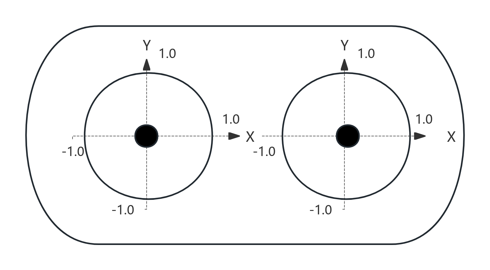

1. 左右摇杆x轴和y轴的取值范围为[-1.0, 1.0];
2. 左右摇杆x轴和y轴的方向上/右为正，如示意图所示；

## 高层运动控制机器人状态介绍

机器人的运动包含站立锁定、平衡站立、基础运动、特技动作状态，机器人在运行过程中，通过状态机在不同状态之间进行切换，以实现不同的控制任务。各个状态的解释说明如下：

- **站立锁定**：站立锁定是连接机器人挂起落地和平衡站立的状态，机器狗需要进入平衡站立状态后，才能调用相应的运动服务实现机器人的控制。
- **平衡站立**：在平衡站立状态下，可调用SDK的各部分接口实现机器人的特技动作和基础运动控制。
- **基础运动**：在运动执行过程中，可调用SDK接口，让机器人进入不同的步态。
- **特技动作**：当进入特殊动作执行状态后，其他运动控制服务会先被挂起，等待当前动作执行完毕并进入平衡站立状态后再生效。

机器人状态切换机制；

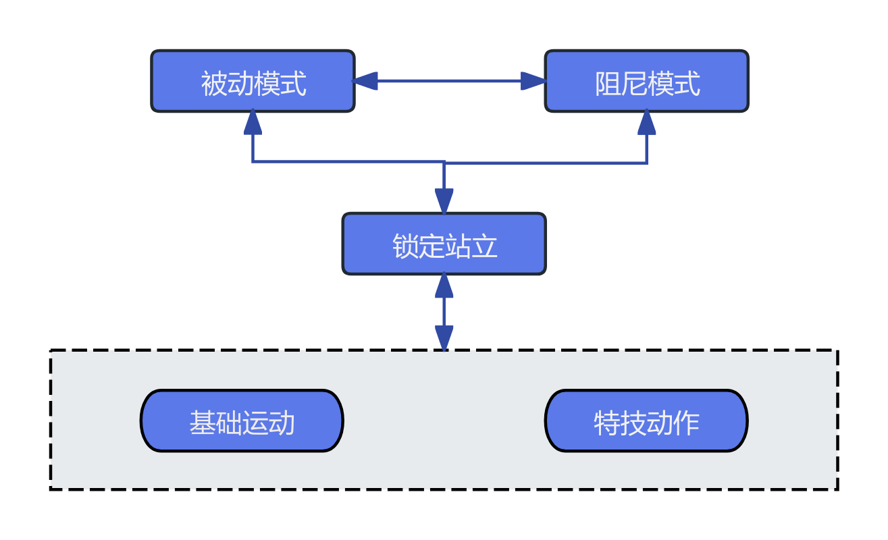

## 高层运动控制接口

机器人的高层运动控制服务可分为基础运动控制和特技动作控制。
- 基础运动控制服务中，可调用相应的接口，根据不同的地形场景和任务需求切换机器人的行走步态。
- 特技动作控制服务中，可调用相应的接口，实现机器人内置的特殊特技，比如庆祝、握手、打招呼等。

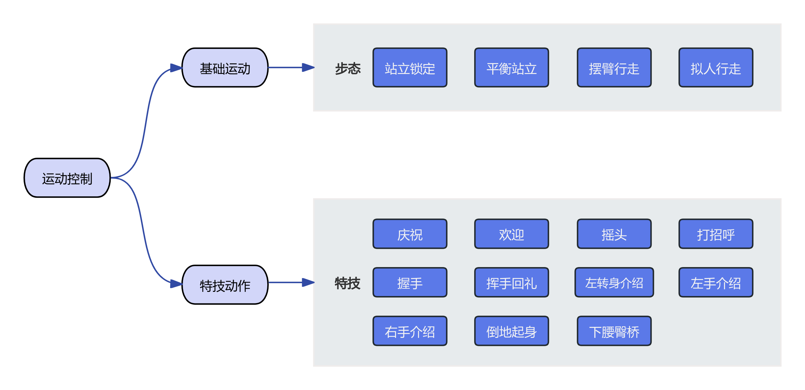

### 步态切换

<table style="width: 100%; table-layout: fixed; border-collapse: collapse; text-align: center;">
  <thead>
    <tr>
      <th style="width: 20%; text-align: center;"><strong>当前步态</strong></th>
      <th style="width: 40%; text-align: center;"><strong>步态切换流程</strong></th>
      <th style="width: 40%; text-align: center;"><strong>示意图</strong></th>
    </tr>
  </thead>
  <tbody>
    <tr>
      <td style="text-align: center;">站立锁定</td>
      <td>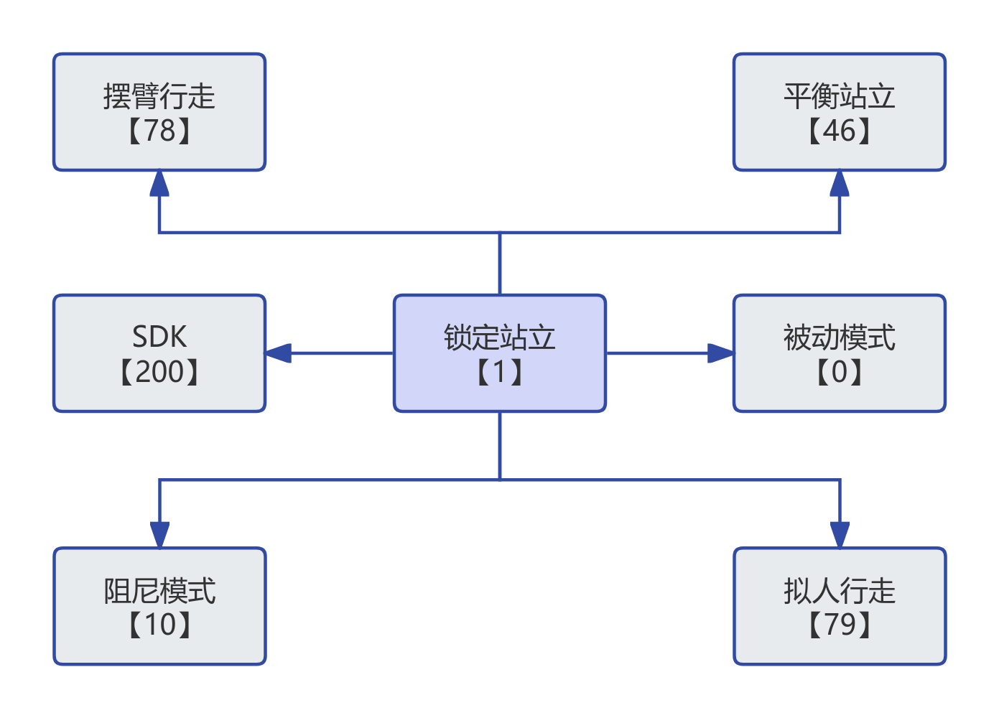</td>
      <td></td>
    </tr>
    <tr>
      <td style="text-align: center;">平衡站立</td>
      <td>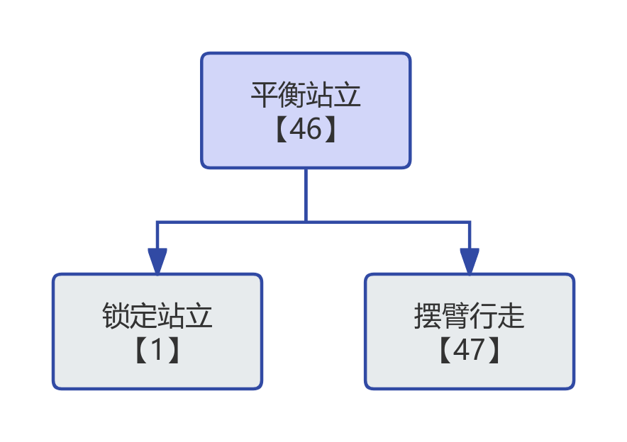</td>
      <td></td>
    </tr>
    <tr>
      <td style="text-align: center;">摆臂行走</td>
      <td>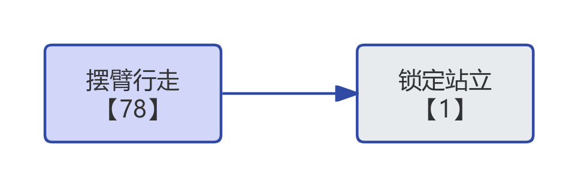</td>
      <td></td>
    </tr>
    <tr>
      <td style="text-align: center;">拟人行走</td>
      <td>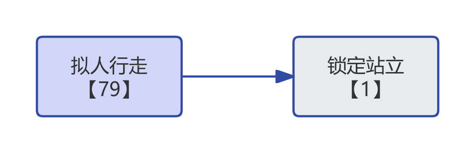</td>
      <td></td>
    </tr>
  </tbody>
</table>

---

### 特技执行

<table style="width: 100%; table-layout: fixed; border-collapse: collapse; text-align: center;">
  <thead>
    <tr>
      <th style="width: 20%; text-align: center;"><strong>特技</strong></th>
      <th style="width: 40%; text-align: center;"><strong>特技执行流程</strong></th>
      <th style="width: 40%; text-align: center;"><strong>示意图</strong></th>
    </tr>
  </thead>
  <tbody>
    <tr>
      <td>庆祝</td>
      <td>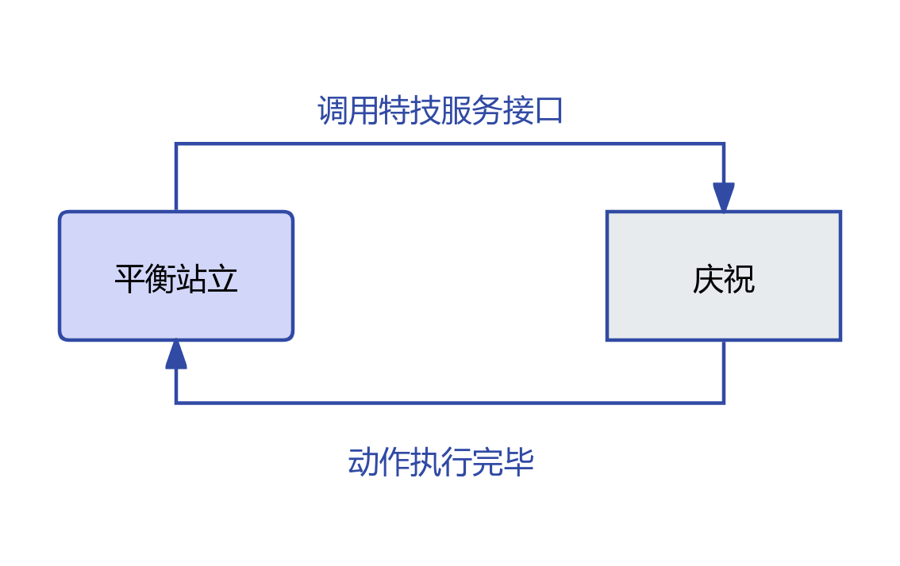</td>
      <td></td>
    </tr>
    <tr>
      <td>欢迎</td>
      <td>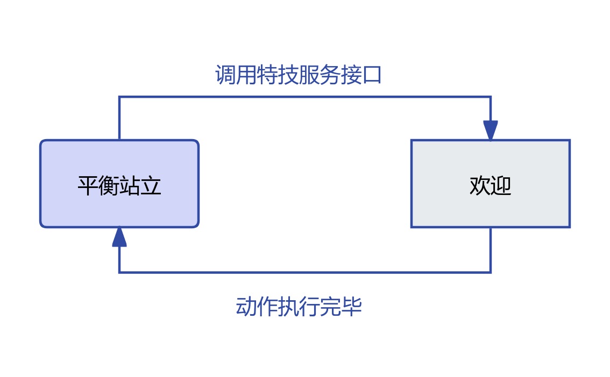</td>
      <td></td>
    </tr>
    <tr>
      <td>摇头</td>
      <td>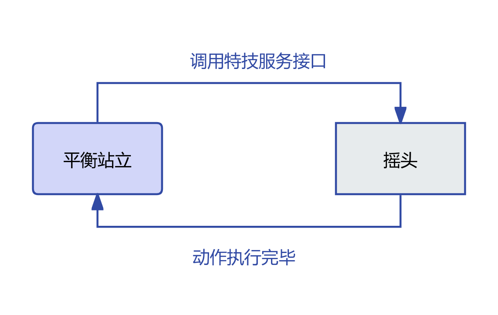</td>
      <td></td>
    </tr>
    <tr>
      <td>打招呼（左手）</td>
      <td>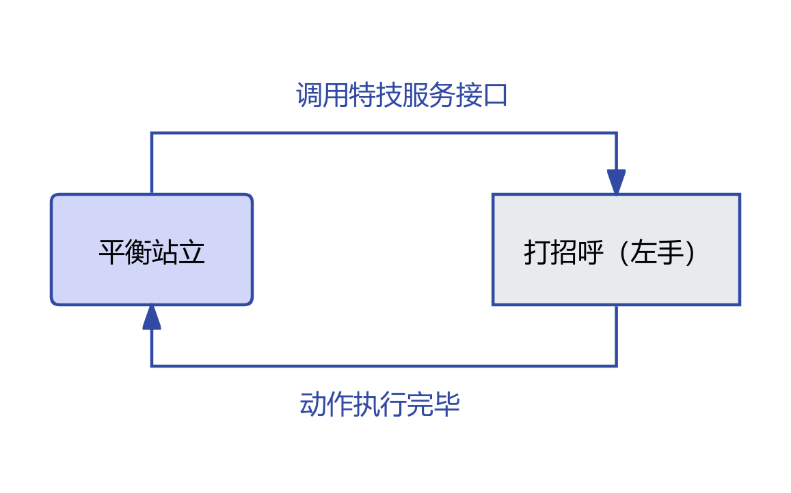</td>
      <td></td>
    </tr>
    <tr>
      <td>打招呼（右手）</td>
      <td>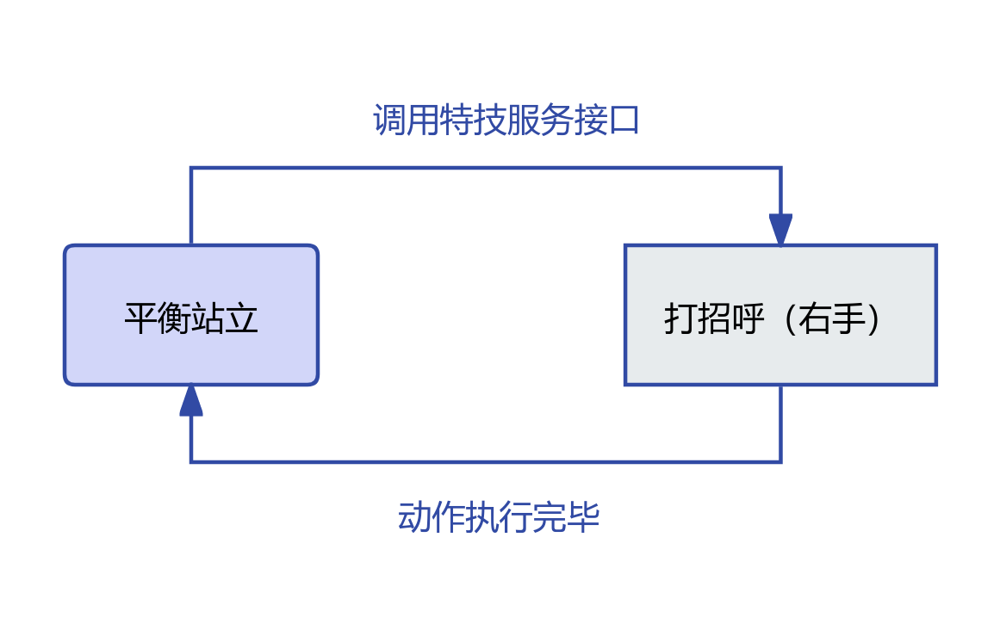</td>
      <td></td>
    </tr>
    <tr>
      <td>握手（左手）</td>
      <td>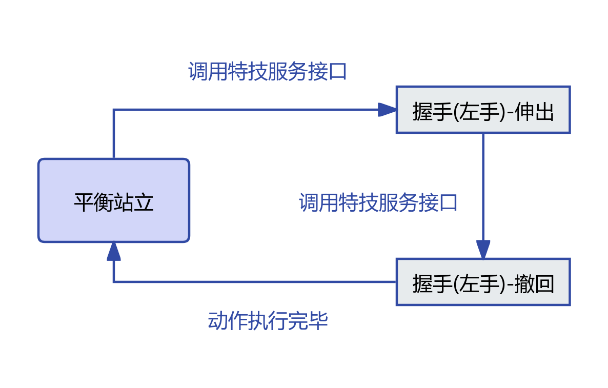</td>
      <td></td>
    </tr>
    <tr>
      <td>握手（右手）</td>
      <td></td>
      <td></td>
    </tr>
    <tr>
      <td>左转身介绍</td>
      <td>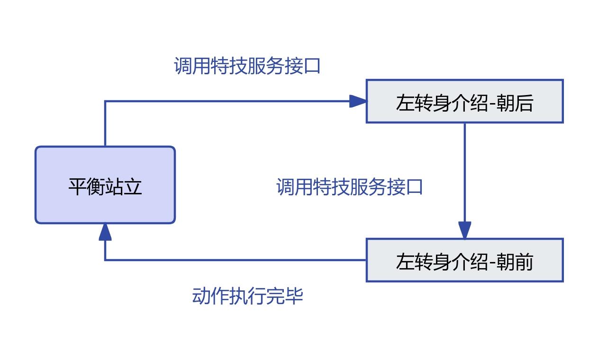</td>
      <td></td>
    </tr>
    <tr>
      <td>右转身介绍</td>
      <td></td>
      <td></td>
    </tr>
  </tbody>
</table>