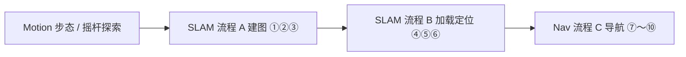

# nav_viz.py — MagicBot Z1 导航可视化 GUI

基于 **magicbot_z1_sdk**（`magicbot_z1_python`）的桌面工具，通过 **gRPC** 连接机载服务，完成：

- 高层运动（步态、特技、虚拟摇杆 20Hz）
- SLAM 建图与地图管理
- 栅格地图导航（初始位姿、目标点、任务控制）
- 语音 / TTS（Audio，gRPC）
- RTSP 相机预览（可选，不经过 SDK）

---

## 目录

- [环境要求](#环境要求)
- [快速开始](#快速开始)
- [界面概览](#界面概览)
- [推荐使用流程](#推荐使用流程)
- [连接时 SDK 初始化](#连接时-sdk-初始化)
- [各页功能与 API 对照](#各页功能与-api-对照)
- [操作反馈与日志](#操作反馈与日志)
- [命令行参数](#命令行参数)
- [常见问题](#常见问题)
- [相关文件](#相关文件)

---

## 环境要求

| 项目 | 说明 |
|------|------|
| Python | 3.8+ |
| 系统包 | `python3-tk`（Tkinter） |
| Python 依赖 | 见 `requirements.txt`：`numpy`、`matplotlib`（地图）；`opencv-python`、`Pillow`（Video 页 RTSP，可选） |
| SDK | 已编译 `magicbot_z1_python`，产物在 `magicbot_z1_sdk/build/` |
| 网络 | PC 与机器人在同一网段；默认 PC `192.168.54.111`，机器人机载 gRPC 由 SDK 配置（通常 `192.168.54.119`） |
| 中文字体（推荐） | `fonts-noto-cjk` 或 `fonts-wqy-microhei`，避免界面与地图中文为方框 |
| Linux RTSP | 系统安装 FFmpeg（OpenCV 拉流），例如 `sudo apt install ffmpeg` |

```bash
# Ubuntu 示例
sudo apt install python3-tk fonts-noto-cjk ffmpeg
pip install -r requirements.txt
```

未安装 OpenCV / Pillow 时仍可启动 GUI，**Video** 页会提示安装依赖，其余 Tab 正常。

---

## 快速开始

```bash
# 1. 编译 SDK（在 magicbot_z1_sdk 根目录）
./build.sh
# 或: mkdir -p build && cd build && cmake .. && make -j

# 2. 运行 GUI
cd example/python_viz
export PYTHONPATH=/path/to/magicbot_z1_sdk/build:$PYTHONPATH
export LD_LIBRARY_PATH=/path/to/magicbot_z1_sdk/build:$LD_LIBRARY_PATH
python3 nav_viz.py --local-ip 192.168.54.111 --robot-ip 192.168.54.119
```

1. 在 **Connection** 栏确认 **Local IP**，点击 **Connect**（**Robot IP** 仅用于 RTSP 视频 URL）。
2. 建图或导航前，在 **Motion** 将步态设为 **Humanoid walk** 或 **Balance stand**。
3. 按下方 [推荐使用流程](#推荐使用流程) 在 **SLAM** → **Nav** 页操作。
4. 底部 **Log · 操作反馈** 查看结果；可拖动分隔条调整日志区高度。

---

## 界面概览

主窗口默认约 **1200×860**（最小 960×640），自上而下：

| 区域 | 内容 |
|------|------|
| 标题栏 | 产品名 + 功能摘要（gRPC · Motion · SLAM · Nav · Audio · Video） |
| Connection | Local IP、Robot IP (RTSP)、Connect / Disconnect、连接状态 |
| Tab 区 | 五个标签页（可滚动页用右侧滚动条 / 滚轮） |
| Log · 操作反馈 | 可拖动分隔条；全局状态徽章 + 滚动日志 |

| Tab | 作用 |
|-----|------|
| **Motion** | 步态 / 特技 / 虚拟摇杆推流 |
| **SLAM** | 流程 A 建图、流程 B 加载与定位、地图维护 |
| **Nav** | 流程 C 导航、位姿参数、占用栅格地图交互 |
| **Audio** | 音量、TTS（Z1 暂未开放语音配置切换） |
| **Video** | RTSP 预览 + 摇杆（与 Motion 共用一条推流） |

**摇杆推流**：Motion 与 Video 各有一套摇杆 UI，但同一时刻只有一路 20Hz `send_joystick_command`；在某一页点击 **Start stream** 后，读数来自该页摇杆。

---

## 推荐使用流程

建图 / 导航前，在 **Motion** 将步态设为 **Humanoid walk**（`GAIT_HUMANOID_WALK`）或 **Balance stand**（`GAIT_BALANCE_STAND`）。



| 阶段 | 页面 | 要点 |
|------|------|------|
| 探索 / 步态 | Motion | `Set gait` → 建图用摇杆巡逻需 **Start stream** |
| 新环境建图 | SLAM · 流程 A | ① 开始建图 → ② Motion 探索 → ③ 保存地图 |
| 已有地图 | SLAM · 流程 B | ④ 刷新列表 → ⑤ 加载 → ⑥ 切换定位（需 `map_path`） |
| 导航 | Nav · 流程 C | ⑦ 刷新地图 → ⑧ Nav mode ON → ⑨ 初始位姿 → ⑩ 目标与导航 |

**map_path**：流程 B 的「加载」「切换定位」及 Nav 的「Nav mode ON」会调用 `get_map_path`，将路径写入会话；定位 / 导航 API 必须携带该路径。

---

## 连接时 SDK 初始化

点击 **Connect** 后，`RobotSession` 内部顺序：

| 步骤 | Python API | 说明 |
|------|------------|------|
| 1 | `MagicRobot()` | 创建实例 |
| 2 | `initialize(local_ip)` | 绑定本机 IP，初始化各子控制器 |
| 3 | `connect()` | gRPC 连接机载服务 |
| 4 | `set_motion_control_level(ControllerLevel.HighLevel)` | 高层控制 |
| 5 | `get_high_level_motion_controller()` / `get_slam_nav_controller()` 等 | 运动、SLAM、Audio、StateMonitor |
| 6 | `audio.initialize()` / `high.initialize()` / `slam.initialize()` / `monitor.initialize()` | 子模块初始化 |
| 后台 | `get_current_localization_info()` / `get_nav_task_status()` / `get_current_state()` | 约 0.5s 轮询 |

**Disconnect**：停止摇杆线程 → 各子控制器 `shutdown()` → `disconnect()` → `shutdown()`。

**Video** 使用 OpenCV 直连 RTSP，不经过 SDK；**Robot IP** 字段只影响 RTSP URL，不参与 `initialize()`。

---

## 各页功能与 API 对照

### Connection

| GUI | Python API |
|-----|------------|
| Connect | `initialize` → `connect` → `set_motion_control_level(HighLevel)` → 子控制器 `initialize` |
| Disconnect | 各 `shutdown` → `disconnect` → `shutdown` |

---

### Motion

| GUI | Python API | C++ `HighLevelMotionController` |
|-----|------------|----------------------------------|
| Set gait | `high.set_gait(GaitMode)` | `SetGait` |
| Get gait | `high.get_gait()` → `(Status, GaitMode)` | `GetGait` |
| Execute | `high.execute_trick(TrickAction)` | `ExecuteTrick` |
| Start stream | 20Hz `high.send_joystick_command(JoystickCommand)` | `SendJoyStickCommand` |
| Stop | 停止线程，摇杆回中发零 | — |

**Z1 步态**（`magic_type.h`）：`GAIT_PASSIVE`、`GAIT_RECOVERY_STAND`、`GAIT_BALANCE_STAND`、`GAIT_HUMANOID_WALK`、`GAIT_LOWLEVL_SDK`、`GAIT_HYBRID_SDK`。

**摇杆轴**（`JoystickCommand`）：

| 摇杆 | 字段 | 含义 |
|------|------|------|
| 左 | `left_x_axis`, `left_y_axis` | 横向、前进（Y 向上为正） |
| 右 | `right_x_axis` | 偏航 / 转向 |

---

### SLAM

| 步骤 | GUI | Python API | 说明 |
|------|-----|------------|------|
| ① | 开始建图 | `activate_slam_mode(MAPPING)` + `start_mapping()` | 一次按钮完成两步 |
| ① | 取消建图 | `cancel_mapping()` | |
| ③ | 保存地图 | `save_map(name)` | |
| ④ | 刷新列表 | `get_all_map_info()` | 同时尝试 `get_map_path` 刷新栅格 |
| ⑤ | 加载选中 | `load_map(name)` + `get_map_path(name)` | |
| ⑥ | 切换定位 | `activate_slam_mode(LOCALIZATION, map_path)` | 需先有 `map_path` |
| — | 删除选中 | `delete_map(name)` | |
| — | 关闭 SLAM（Idle） | `activate_slam_mode(IDLE)` | |

---

### Nav（地图导航）

| 步骤 | GUI | Python API | 说明 |
|------|-----|------------|------|
| ⑦ | 刷新地图 | `get_all_map_info()` | 刷新右侧占用栅格 |
| ⑧ | Nav mode ON | `activate_nav_mode(GRID_MAP, map_path)` | 需 `map_path` |
| ⑨ | 提交 Init pose | `init_pose(Pose3DEuler)` | position [X,Y,0] + orientation [Roll,Pitch,Yaw]（rad） |
| ⑨ | 填入定位位姿 | — | 从 `get_current_localization_info()` 写入 |
| ⑩ | 导航到目标点 | 见下「发起导航」 | `set_nav_target` |
| ⑩ | 暂停 / 继续 / 取消 | `pause_nav_task()` / `resume_nav_task()` / `cancel_nav_task()` | |
| — | 查询导航状态 | `get_nav_task_status()` | 状态含 `error_code` / `error_desc` |

**发起导航**（工具栏 / 左键双击，模式为「导航目标」）：

1. 停止摇杆推流（`_on_joy_stop`）
2. 构造 `NavTarget`（`frame_id="map"`，目标来自「导航目标」行 X/Y/Yaw）
3. `set_nav_target(tgt)`

**不会**在发目标时自动切换步态；步态请在 **Motion** 页事先设好。

**地图鼠标**（需先选「地图点击」模式）：

| 操作 | 导航目标模式 | 初始位姿模式 |
|------|----------------|----------------|
| 左键单击 | 设置目标 X/Y | 设置初始 X/Y |
| 右键按住拖动 | 以当前 X/Y 为圆心设 Yaw | 同左 |
| 左键双击 | `set_nav_target` | `init_pose` |

**图例**：绿箭头 = 当前定位；黄箭头 = 初始位姿预览；红叉 + 短箭头 = 导航目标。

---

### Audio

对应 `AudioController`（`sdk/include/magic_audio.h`）。

| 区域 | GUI | Python API |
|------|-----|------------|
| 音量 | 滑块 0–100，Get / Set | `get_volume()` / `set_volume()` |
| TTS | ID、Priority、Mode、文本，Play / Stop | `play(TtsCommand)` / `stop()` |

Z1 SDK **暂未提供** `get_voice_config` / `switch_tts_voice_model`；Audio 页对应按钮会提示不可用。

Connect 时会调用 `audio.initialize()`。

---

### Video（RTSP）

不经过 SDK；**OpenCV + Pillow** 解码，`ImageTk` 显示。

| GUI | 说明 |
|-----|------|
| URL | 默认 `rtsp://<Robot IP>:<rtsp-port>`，默认端口 **8082** |
| 同步机器人 IP | 从 Connection 的 Robot IP 重写 URL |
| Start / Stop | 后台线程 `VideoCapture` 读帧 |
| 摇杆 | 与 Motion 共用推流 |

---

## 操作反馈与日志

Tab 区与 **Log · 操作反馈** 之间有**可拖动分隔条**。

| 徽章 | 含义 |
|------|------|
| `IDLE` 灰 | 等待操作 |
| `···` 黄 | 已点击，执行中 |
| `OK` 绿 | 成功 |
| `FAIL` 红 | 失败 |

---

## 命令行参数

```bash
python3 nav_viz.py --help
```

| 参数 | 默认值 | 说明 |
|------|--------|------|
| `--local-ip` | `192.168.54.111` | 本机在与机器人同一局域网内的 IP（SDK `initialize`） |
| `--robot-ip` | `192.168.54.119` | 机器人 IP，**仅用于 RTSP** 默认 URL |
| `--rtsp-port` | `8082` | Video 页默认 RTSP 端口 |

---

## 常见问题

| 现象 | 处理 |
|------|------|
| `Cannot import magicbot_z1_python` | 编译 SDK，`export PYTHONPATH=.../build:$PYTHONPATH` |
| 中文方框 / Matplotlib 缺字 | 安装 `fonts-noto-cjk` |
| 地图空白 | SLAM 页 **加载选中** 后，Nav 页点 **刷新地图** |
| 切换定位 / 开导航失败 | 先 **加载地图** 或 **刷新列表**，确保已有 `map_path` |
| 导航失败 | 完成 SLAM ⑥、Nav ⑧⑨；步态为 **Humanoid walk** 或 **Balance stand** |
| RTSP 黑屏 | 核对 Robot IP、端口；安装 `opencv-python`、`ffmpeg` |
| 摇杆无响应 | 需 **Connect** 且 **Start stream** |
| 发目标后步态变了 | 当前版本**不会**自动切步态；若行为异常检查是否在 Motion 页手动 Set gait |

---

## 相关文件

| 路径 | 说明 |
|------|------|
| `nav_viz.py` | GUI 主程序 |
| `requirements.txt` | Python 第三方依赖 |
| `../python/slam_example.py` | 键盘版 SLAM 示例 |
| `../python/navigation_example.py` | 导航示例 |
| `../python/audio_example.py` | Audio API 示例 |
| `sdk/include/magic_motion.h` | 高层运动 API |
| `sdk/include/magic_slam_navigation.h` | SLAM / 导航 API |
| `sdk/include/magic_audio.h` | 语音 / TTS API |
| `sdk/include/magic_type.h` | `GaitMode`、`TrickAction`、`NavTarget` 等 |
